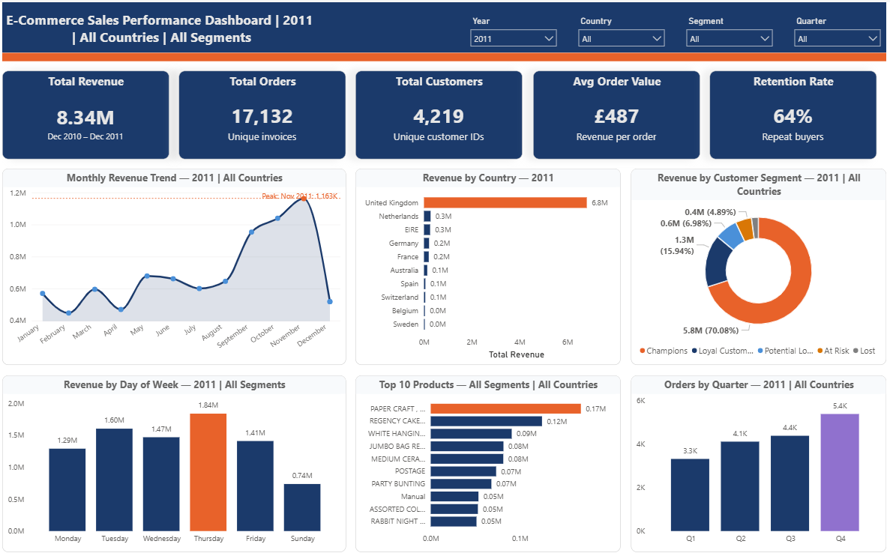
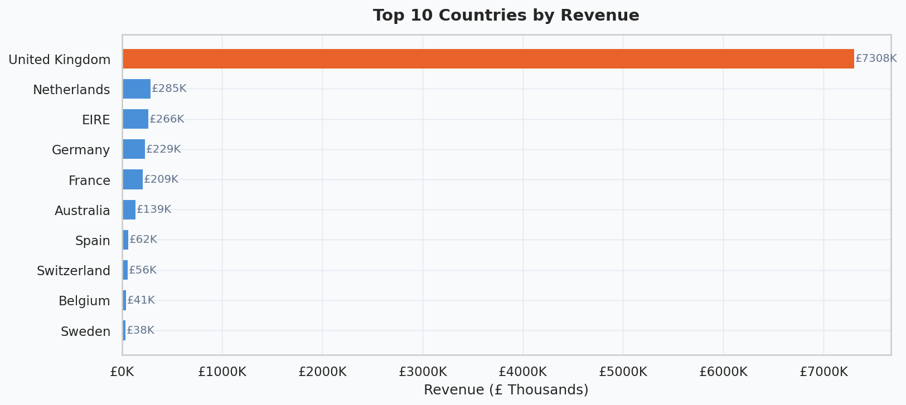
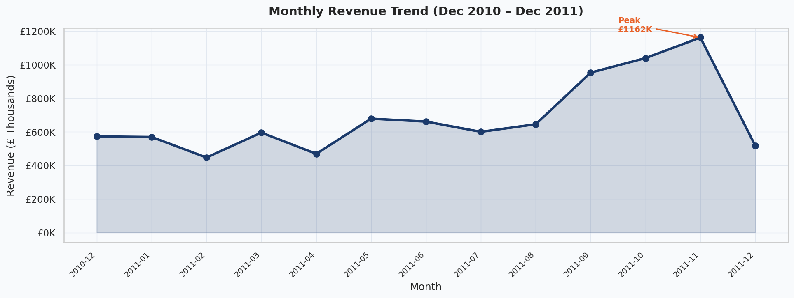
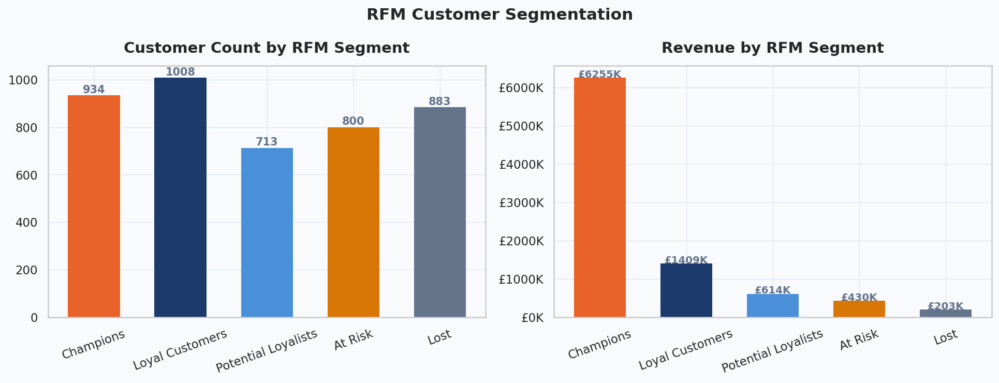
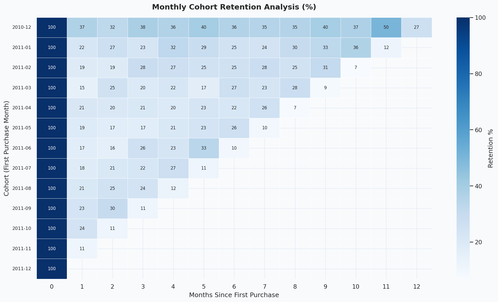
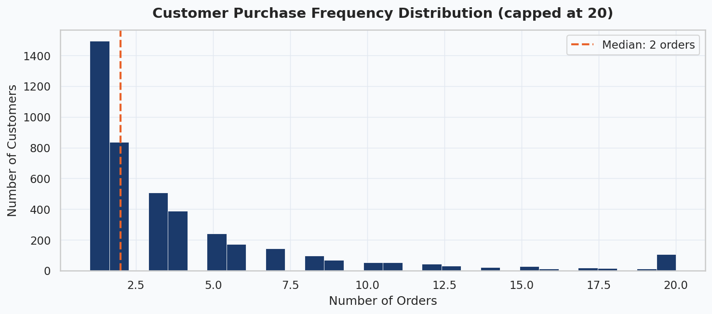
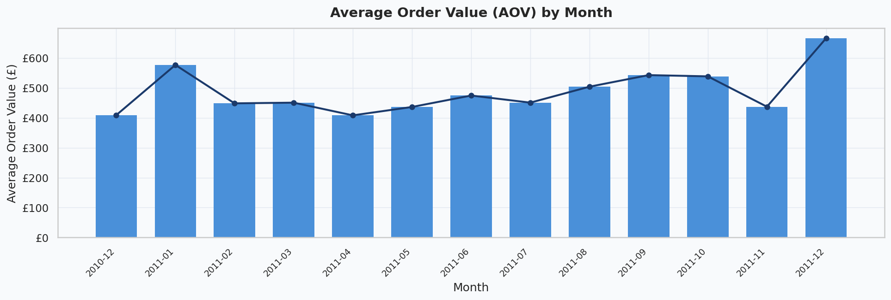
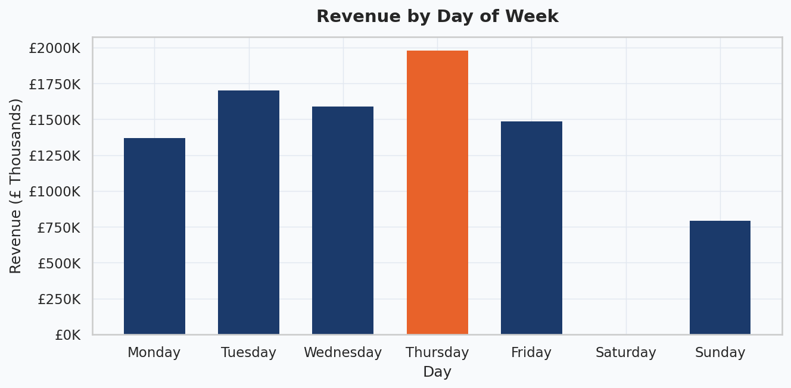

# E-Commerce Sales Performance Analysis
### Identifying Revenue Growth Opportunities and Customer Retention Strategies for an Online Retail Business


---

## 📊 Dashboard



> The static image above is a snapshot of the live dashboard.
> **The interactive version** supports filtering by Year, Country, Customer Segment, and Quarter — with dynamic titles that update on every selection.
> - 🔗 [View Live Dashboard →](https://app.powerbi.com/groups/me/reports/5900d8ac-fb50-45cc-a583-5d4ff48cb27d/24a0f9a1c68a8b22acf6?experience=power-bi) *(Requires a Power BI account)*
> - 📥 [Download Power BI File (.pbix) →](ecommerce_dashboard.pbix) *(Open locally with Power BI Desktop)*

---

## Project Summary

An online gift and homewares retailer needed to understand where its revenue was coming from, which customers were most valuable, and why a large portion of buyers never returned after their first purchase. This project analyses over 500,000 transactions across 37 countries to answer those questions and deliver clear, actionable strategies for growth.

> **Bottom line:** 70% of revenue came from just 934 customers. Month-1 retention was only 20–25%. 35% of customers never came back. This project identifies why — and what to do about it.

---

## Table of Contents

- [Business Problem](#-business-problem)
- [Dataset Overview](#-dataset-overview)
- [Tools Used](#-tools-used)
- [Project Structure](#-project-structure)
- [Data Cleaning & Preparation](#-data-cleaning--preparation)
- [Key Questions Explored](#-key-questions-explored)
- [Key Insights](#-key-insights)
- [Recommendations](#-recommendations)
- [Visualisations](#-visualisations)
- [How to Run This Project](#-how-to-run-this-project)
- [Limitations](#-limitations)
- [Contact](#-contact)

---

## Business Problem

The business was growing in revenue but facing three structural problems that threatened long-term sustainability:

1. **Over-reliance on a single market** — Was the business too dependent on UK customers?
2. **Poor customer retention** — Why were so many customers not coming back after their first order?
3. **Unclear customer value** — Which customers were worth investing in, and which were already lost?

This analysis was built to answer those questions with data — and to give leadership a clear set of next steps.

---

## Dataset Overview

| Property | Detail |
|---|---|
| **Source** | UCI Machine Learning Repository — Online Retail Dataset |
| **Raw Records** | 541,909 transactions |
| **Clean Records** | 397,884 transactions (73% retained after cleaning) |
| **Columns** | 8 |
| **Time Period** | December 2010 – December 2011 |
| **Countries** | 37 |
| **Unique Customers** | 4,338 |
| **Unique Products (SKUs)** | 3,665 |
| **Total Revenue** | £8.9 Million |

### Data Dictionary

| Column | Type | Description |
|---|---|---|
| `InvoiceNo` | String | Unique invoice ID. Prefix 'C' = cancellation |
| `StockCode` | String | Unique product / SKU code |
| `Description` | String | Product name |
| `Quantity` | Integer | Units sold. Negative = return |
| `InvoiceDate` | DateTime | Date and time of the transaction |
| `UnitPrice` | Float | Price per unit in British Pounds (£) |
| `CustomerID` | Float | Unique customer identifier (135K rows missing) |
| `Country` | String | Customer's country |

---

## Tools Used

| Tool | Purpose |
|---|---|
| **Python** | Core analysis language |
| **Pandas & NumPy** | Data cleaning, transformation, and aggregation |
| **Matplotlib & Seaborn** | Data visualisation |
| **Jupyter Notebook** | Structured, reproducible analysis environment |

---

## 📁 Project Structure

```
ecommerce-sales-performance-analysis/
│
├── data/
│   └── data.csv                    # Raw dataset (UCI Online Retail)
├── dashboard/
│    ├── ecommerce_dashboard.PNG    # Dashboard snapshot
│    ├── ecommerce_dashboard.pbix   # Interactive dashboard
│ 
├── charts/                         # All 10 generated visualisations
│   ├── 01_monthly_revenue.png
│   ├── 02_top_countries.png
|   ├── 03_day_of_week.png
│   ├── 04_aov_monthly.png
│   ├── 05_purchase_frequency.png
│   ├── 06_clv_distribution.png
│   ├── 07_top_products.png
│   ├── 08_underperforming.png
│   ├── 09_cohort_retention.png
│   ├── 10_rfm_segments.png
│
├── ecommerce_analysis.ipynb        # Full Jupyter Notebook (primary deliverable)
├── ecommerce_report.docx           # Analytical report (Word)
├── ecommerce_analysis.pptx         # Executive presentation (PowerPoint)
├── requirements.txt                # Python dependencies
└── README.md                       # This file
```

---

## 🧹 Data Cleaning & Preparation

The raw dataset had several quality issues that were resolved before analysis began.

| Issue | Rows Affected | Action Taken |
|---|---|---|
| Cancelled orders (InvoiceNo starts with 'C') | ~9,000 | Removed |
| Missing CustomerID | 135,080 | Removed — cannot be attributed to any customer |
| Zero or negative Quantity | ~10,000 | Removed — returns or data entry errors |
| Zero UnitPrice | ~2,000 | Removed — likely internal stock movements |
| Missing Description | 1,454 | Retained where all other fields were valid |
| **Final clean dataset** | **397,884 rows** | ~73% of raw data retained |

**New features engineered during preparation:**

- `Revenue` = Quantity × UnitPrice
- `Year`, `Month`, `DayOfWeek` — for time-based trend analysis
- `YearMonth` — period index for monthly aggregations
- `CohortMonth` — the month a customer made their first ever purchase
- `CohortIndex` — months elapsed since first purchase
- `R_Score`, `F_Score`, `M_Score` — RFM quintile scores (1–5)
- `RFM_Score` — composite score (sum of R + F + M, range: 3–15)
- `Segment` — customer label derived from RFM score (Champions, Loyal, At Risk, Lost)

---

## Key Questions Explored

1. How has revenue trended month-by-month over the analysis period?
2. Which countries generate the most revenue, and how dependent is the business on the UK?
3. Which products are the top revenue drivers, and which are underperforming?
4. What does a typical customer's purchase behaviour look like?
5. How does Average Order Value change across the year?
6. How well does the business retain customers after their first purchase?
7. Which customer segments exist, and what is each segment worth?
8. Which day of the week drives the highest sales activity?

---

## Key Insights

**1. The business is dangerously dependent on one market.**

83% of all revenue came from the United Kingdom. The next largest market — the Netherlands — contributed a fraction of that. Any softening of UK demand would have an outsized impact on the entire business.


**2. Revenue is seasonal, and Q4 is everything.**

Monthly revenue peaked at over £1.2M in November 2011 — the highest month on record. The business effectively wins or loses its year in a 6–8 week window during the Christmas gifting season.


**3. A tiny group of customers is carrying the entire business.**

Just 934 customers (Champions segment) generated £6.25M — 70% of total revenue. Losing even a small number of these customers would have a severe impact on the bottom line.


**4. The business is losing most new customers within the first month.**

Cohort analysis showed that only 20–25% of customers who made their first purchase in any given month returned the following month. By month three, retention had fallen to single digits for most cohorts.


**5. More than a third of customers never come back.**

Approximately 35% of all customers made exactly one purchase and were never seen again — a significant and largely preventable revenue leak.


**6. Customers spend more in Q4, but this uplift is not being fully captured.**

Average Order Value increases noticeably during Q4, reflecting gift-driven basket sizes. There is no evidence of structured upselling or bundling strategies to amplify this natural spending behaviour.


**7. Thursday is the best day to reach customers.**

Thursday consistently recorded the highest revenue of any day of the week. Saturday and Sunday were the weakest — a pattern that held consistently across the full analysis period.


---

## Recommendations

**1. Launch a VIP programme for Champions.**
934 customers are generating 70% of revenue but likely receiving the same experience as everyone else. A dedicated loyalty tier with early access, free delivery, and personalised outreach would protect this relationship at minimal cost.

**2. Run an automated win-back campaign for at-risk customers.**
800 customers are disengaging, putting £430K in revenue at risk. A three-step email sequence — discount offer, product spotlight, final reminder — can recover a meaningful portion before they are lost.

**3. Create a post-purchase nurture flow for first-time buyers.**
Trigger an email sequence at 14, 30, and 60 days after a first order. Offer 10% off the second purchase. Converting even 20% of one-time buyers to repeat customers would add significant incremental revenue.

**4. Prepare for Q4 earlier and more aggressively.**
Pre-stock top SKUs by September. Launch paid campaigns in late September before competitor spend peaks. Introduce gift bundles at £25, £50, and £75 to increase basket size during the peak gifting window.

**5. Expand into key international markets.**
The Netherlands, Germany, France, Ireland, and Australia all show genuine demand. Localised pages, regional fulfilment partnerships, and local payment options would reduce friction and lower UK revenue dependency from 83%.

**6. Align all campaigns with peak buying days.**
Schedule email sends and paid ads for Tuesdays and Thursdays. Test weekend flash sales to lift Saturday performance. This costs nothing to implement and can deliver an immediate improvement in campaign conversion.

---

## ▶️ How to Run This Project

**1. Clone the repository**
```bash
git clone https://github.com/gogoharrison/ecommerce-sales-performance-analysis.git
cd ecommerce-sales-performance-analysis
```

**2. Install dependencies**
```bash
pip install -r requirements.txt
```

**3. Add the dataset**

Download the dataset from the [UCI Machine Learning Repository](https://archive.ics.uci.edu/ml/datasets/online+retail) and place `data.csv` inside the `/data` folder.

**4. Run the notebook**
```bash
jupyter notebook ecommerce_analysis.ipynb
```

> All cells are designed to run sequentially from top to bottom. Charts are saved automatically to the `/charts` folder.

**Requirements (`requirements.txt`)**
```
pandas>=1.5.0
numpy>=1.23.0
matplotlib>=3.6.0
seaborn>=0.12.0
jupyter>=1.0.0
```

---

## ⚠️ Limitations

- **No marketing spend data** — it is not possible to calculate true customer acquisition cost or measure campaign ROI from this dataset alone.
- **No product categories** — the raw data has no category column. Category-level analysis relied on product description text, which is inconsistent in quality.
- **Incomplete December 2011 data** — the dataset ends on 9th December 2011, so month-on-month comparisons for that month should be read with caution.
- **No customer demographics** — age, gender, and income data are unavailable, which limits the depth of behavioural segmentation.

---

## 👤 Contact

**Name:** Gogo Harrison 
**LinkedIn:** [linkedin.com/in/gogo-harrison](https://linkedin.com/in/gogo-harrison)  
**Email:** gogoharrison66@gmail.com  
**Portfolio:** [gogoharrison.github.io](https://gogoharrison.github.io)

---
